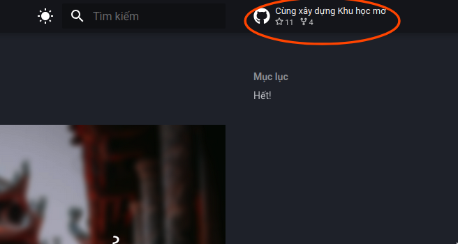
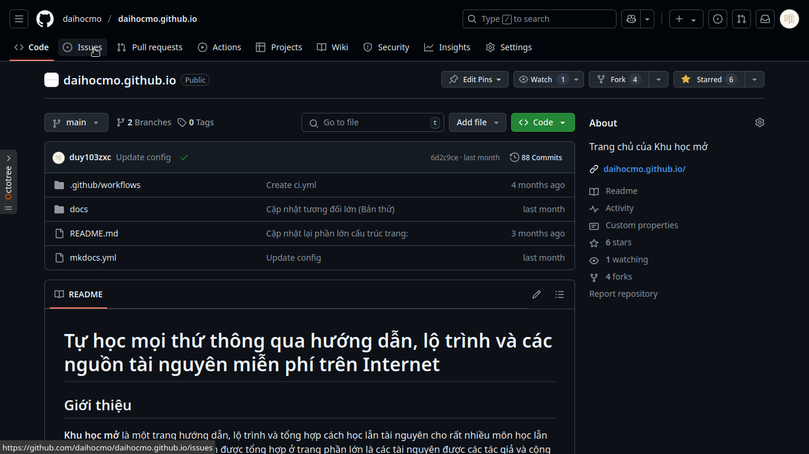

# Hướng dẫn đóng góp cho Khu học mở

## Thông qua Github

Toàn bộ dự án Khu học mở đang được viết và lưu trữ trên Github (Khu học mở là một dự án mã nguồn mở đóooo :>). Bạn có thể truy cập vào [Trang Github lưu trữ toàn bộ dự án của Khu học mở](https://github.com/daihocmo).

### Mở Issue trên Github

Để gửi lỗi hay các điểm cần cải thiện: Bạn cần mở Issue (vấn đề) cho trang mà bạn muốn góp ý. Dưới đây là hướng dẫn cách mở Issues trên Github. Bạn cần truy cập vào trang nội dung mà bạn muốn sửa, ví dụ như trang chủ này đi:

Khi bạn bấm vào nút "Cùng xây dựng Khu học mở" (Có thể tên sẽ khác tùy từng dự án, nhưng đều ở góc trên bên phải màn hình), trang sẽ được điều hướng đến trang xây dựng dự án trên Github:

Rồi sau đó bấm vào Issue như thế này:

Chuyển sang trang New Issue, bạn cần bấm vào "New Issue":

Và nhập thông tin của vấn đề/đề xuất bạn muốn gửi cho trang là xong!

### Nâng cao: Thực hiện nhiều sửa đổi thông qua Pull Request

Nâng cao hơn, bạn có thể bạn thực hiện gửi Pull Request vào các dự án tương ứng, các thay đổi được thực hiện trên Github sẽ trực tiếp được tự động cập nhật lên các trang mà bạn đóng góp. Bạn có thể xem hướng dẫn cơ bản về Git và Github của **Tôi đi code dạo**:

<iframe width="560" height="315" src="https://www.youtube.com/embed/1JuYQgpbrW0?si=nECQ_YwVjGOXVu_u" title="YouTube video player" frameborder="0" allow="accelerometer; autoplay; clipboard-write; encrypted-media; gyroscope; picture-in-picture; web-share" referrerpolicy="strict-origin-when-cross-origin" allowfullscreen></iframe>

Bạn cần phải thực hiện Fork dự án về tài khoản của bạn (Tức là lưu trữ dự án hiện tại của trang Khu học mở trong tài khoản của bạn) để có thể thực hiện đóng góp vào kho lưu trữ chính của dự án trên Khu học mở. Nó khá phức tạp, vậy nên đây là video hướng dẫn:

<iframe width="560" height="315" src="https://www.youtube.com/embed/dLRA1lffWBw?si=kKLbW6RoiMV_lzrZ" title="YouTube video player" frameborder="0" allow="accelerometer; autoplay; clipboard-write; encrypted-media; gyroscope; picture-in-picture; web-share" referrerpolicy="strict-origin-when-cross-origin" allowfullscreen></iframe>

(Mình nghĩ là mình sẽ làm một video hướng dẫn chỉn chu hơn, nhưng để sau vậy -__-)

## Thông qua các nền tảng khác

### Email

Bạn cũng có thể liên hệ trực tiếp qua [Email](mailto:duykhanh471@protonmail.com).

> Lưu ý: Nếu Email của bạn được viết không rõ ràng (Thiếu tiêu đề, không đi vào nội dung muốn đóng góp, spam, gửi thư rác hoặc những thứ tương tự) thì Email đó sẽ không được phản hồi. Mình sẽ phản hồi chậm nhất là 7 ngày tính từ ngày bạn gửi Email.

### Discord

Bạn có thể mở Thread thảo luận trong Discord của Khu học mở nha, di chuyển đến trang [Cộng đồng](../about/cong-dong.md)