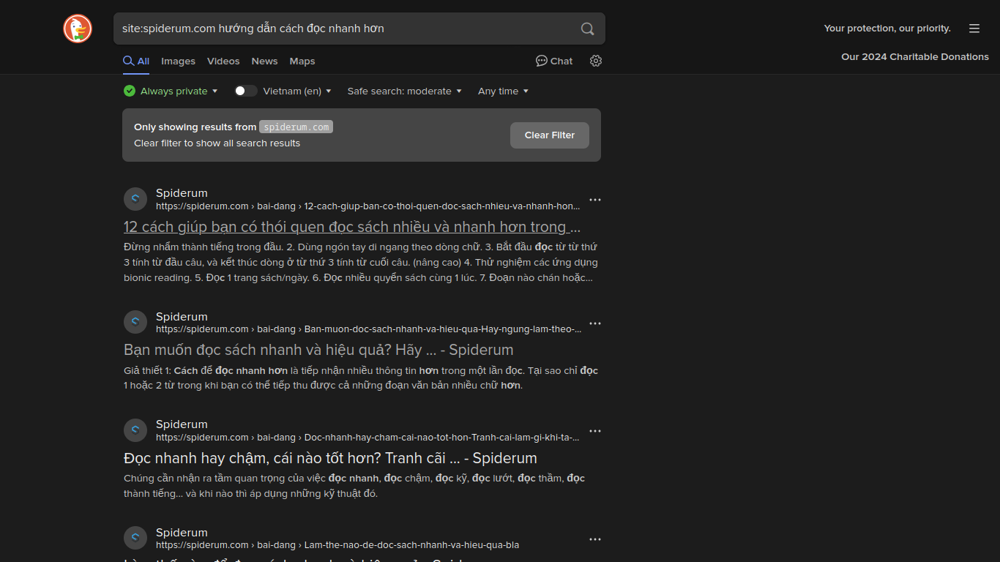

# Hướng dẫn cách tự viết lộ trình tự học cho bất kì một lĩnh vực nào

> **TL;DR**: Chia để trị (Divide and Conquer): Từ một chủ đề lớn hãy chia nhỏ nó ra thành các chủ đề nhỏ hơn.

## Chia để trị

Trong một lĩnh vực/chuyên ngành sẽ có rất nhiều các chủ đề hoặc các phân vùng nhỏ mà bạn cần học. Để bắt tay vào học lĩnh vực/chuyên ngành bạn chọn thì cần hiểu các nhánh kiến thức trong đó.

Bạn có thể đọc trong [bài viết này](https://brunothedev.github.io/p/2024-10-28-how_to_learn.html) và xem cách sử dụng Chatbot để xử lý phần chia để trị (Subdividing).

Cá nhân mình gợi ý bạn tìm trên mạng, tìm thông qua các lộ trình học chuyên ngành từ các trường khác hay là từ các lộ trình tự học được chia sẻ từ các trang khác. Bạn nên tìm nhiều hơn một lộ trình và tổng hợp lại để có cái nhìn tổng quan hơn.

### Làm mẫu một lộ trình

Giả sử bạn đang muốn học vẽ, vậy thì trước tiên là mình đã xác định được thứ mình muốn học là vẽ rồi. Trước khi bắt đầu tìm lộ trình tự học, mình nên tìm hiểu các thông tin xung quanh cơ bản của nó trước. Mình thử tìm ["vẽ" và "hội họa" trên Wikipedia hoặc một số trang trên mạng thì đọc được thêm khá nhiều điều hay về vẽ](https://vi.wikipedia.org/wiki/V%E1%BA%BD#K%E1%BB%B9_thu%E1%BA%ADt). Đây là một số đoạn mình đọc được với những phần mình đánh dấu (Được bôi đậm).

> Sự lựa chọn về cách vẽ của họa sĩ có một tác động lớn đến diện mạo của bức tranh. Tranh bút và mực thường sử dụng **kỹ thuật "hatching," tức là việc sử dụng các đường song song để tạo sắc độ**. "Cross-hatching" sử dụng **kỹ thuật này trong hai hoặc nhiều hướng khác nhau để tạo ra các mức độ tối sáng khác nhau.** "Broken hatching" hoặc các đường với các khoảng cách trống thường tạo ra sự mịn màng trong sắc độ, và việc kiểm soát mật độ của khoảng cách trống giữa các đường giúp tạo ra sự trải màu sắc đa dạng.
>
> Sự sử dụng **"stippling" thì dựa vào việc sử dụng các chấm để tạo ra sắc độ, texture và bóng**. Loại texture cụ thể có thể được tạo ra dựa trên cách mà các chấm được sắp xếp và kết hợp với nhau.

Mình cũng thử tìm về một số bức tranh vẽ trên Pinterest hoặc Pixiv. Mỗi lần nhìn vào tranh trong đó mình lại được nhắc lại về kiểu tranh mình muốn vẽ (Tranh con vật cute, tranh phong cảnh, chân dung nữ .v.v.)

Giờ hãy mở trình duyệt lên và tìm kiếm:

```
lộ trình tự học vẽ
```


Đây là kết quả tìm kiếm. Sau khi đọc qua thì mình chọn ra những bài đăng liên quan tới thứ mình cần tìm.

Đây là danh sách các bài viết về hướng dẫn mà mình muốn đọc khi mới đọc tiêu đề:

- [Học Digital Painting nên bắt đầu từ đâu?](https://colorme.vn/blog/hoc-digital-painting-nen-bat-dau-tu-dau-59284)
- [Quá Trình Học Vẽ: Hướng Dẫn Từ A Đến Z Cho Người Mới Bắt Đầu](https://rdsic.edu.vn/blog/blog-3/qua-trinh-hoc-ve-vi-cb.html)
- [Lộ trình học Digital Painting chuyên sâu cho người mới bắt đầu](https://colorme.vn/blog/lo-trinh-hoc-digital-painting-chuyen-sau-cho-nguoi-moi-bat-dau)

**Mẹo: Bạn có thể đọc lộ trình sử dụng Reader Mode trên trình duyệt để đỡ phải nhìn thấy các phần thừa hoặc quảng cáo trên trang nha.**

Giờ là lúc đọc và phân tích từng lộ trình một (Bạn có thể viết ra giấy hoặc viết trên máy tính sử dụng bất kì phần mềm nào bạn thích):

- **Học Digital Painting nên bắt đầu từ đâu?:** Có hướng dẫn về nền tảng bắt đầu gồm các phần:
    - Vẽ sketch:
        - Ứng dụng hình cơ bản vào tạo hình
        - biểu cảm nhân vật:
        - Phối màu cơ bản
        - Làm việc với cây cọ (Phần này ở trên phần mềm)
    - Gợi ý sách: Một số cuốn sách bằng Tiếng Anh được gợi ý
    - NHẬN XÉT: Có lẽ là một điểm khởi đầu tốt, cần tìm thêm định hướng phía sau nữa
- **Quá Trình Học Vẽ: Hướng Dẫn Từ A Đến Z Cho Người Mới Bắt Đầu**: Mình đọc qua phần Mục lục thì khá thích vì có một số phần mình muốn học, 
    1. Nhìn qua phần mục lục của nó là:
        - II. Bắt Đầu Học Vẽ Cơ Bản 
        - III. Học Vẽ Hình Họa 
        - IV. Học Vẽ Ký Họa 
        - V. Học Vẽ Tranh Màu 
        - VI. Học Vẽ Nâng Cao 
        - VII. Tự Học Vẽ Tại Nhà
    2. Mình không muốn học vẽ màu và nâng cao nên bỏ qua nha, giờ đọc tiếp này.
    3. Mình không phân biệt được giữa hình họa và kí họa nên đi tìm tiếp thì tìm được là (Chỉ cần tìm đơn giản với cú pháp là: [cái này] là gì?):
        - Ký họa là việc vẽ, phác họa nhanh chóng các hiện tượng, sự vật trong cuộc sống
        - Hình họa là môn học dùng hình vẽ để mô tả đối tượng khách quan có thực mà mắt ta quan sát được bằng đường nét, hình mảng, khối, sáng tối, đậm nhạt để tạo ra không gian ảo ba chiều trên mặt phẳng hai chiều.
    4. Đọc qua thì thấy là
        - Phần cơ bản: 
        - Phần hình họa: Luyện tập:
            - Vẽ khối cơ bản
            - Tĩnh vật
            - Vẽ chân dung
            - Phân tích ánh sáng và bóng đổ
        - Ký họa:
            - Ký Họa Phong Cảnh
            - Ký Họa Dáng Người
            - Ký Họa Sâu
        - Các phần đều được ghi không qua chi tiết nhưng cung cấp các định hướng cơ bản cho mình trong hai mảng hình họa và kí họa.

**Tìm được các phần cụ thể rồi thì tìm hướng dẫn cho từng phần:**
        
Đơn giản là gõ tiếp lên thanh tìm kiếm thôi, giờ mình muốn học "Vẽ khối cơ bản" thì chỉ cần:

```
Hướng dẫn vẽ khối cơ bản cho người mới bắt đầu.
```

**Bạn có thể tìm các lộ trình đã được viết bởi những người khác trên các cộng đồng học để đẩy nhanh tốc độ**

Bạn có thể tìm trên các trang như Facebook, Spiderum, Voz Forum hoặc bên Tiếng Anh thì tìm trên Reddit, Medium hoặc HackerNews.

Giờ hãy thử thực hành, mình muốn học cách để đọc nhanh hơn chẳng hạn, thì thử tìm theo cú pháp `site:domain keyword`, chỉ lọc lấy kết quả từ trang mình đã để ở đấy thôi:

```
# Tìm trên Facebook
site:facebook.com hướng dẫn cách đọc nhanh hơn
# Hoặc tìm trên Spiderum
site:spiderum.com hướng dẫn cách đọc nhanh hơn
# Hoặc trên Voz Forum
site:voz.vn hướng dẫn cách đọc nhanh hơn
```

Cá nhân tớ thích tìm trên Spiderum hơn vì cơ bản bài viết trên đấy thường sẽ chất lượng hơn trên Facebook (Sẽ dễ tìm được các nội dung liên quan đến tự học và kiến thức ở trên đây hơn Facebook). Thì tìm luôn trên Spiderum thì ra kết quả như này:



Các bước thực hiện tương tự như ở phần hướng dẫn trên.

## Chuẩn bị tài nguyên học tập

- Wikipedia: Mang tính chất tham khảo chủ đề.
- Youtube: Thường sử dụng khi bị mắc ở một phần bất kì. Tăng tốc độ video lên để tiết kiệm thời gian.
- Sách: Bạn có thể tìm trên Google "[Phần bạn cần học] pdf" rồi **Ctrl + F** và gõ phần bạn cần tìm ra thôi.
- Tìm từ các cộng đồng khác: Bạn có thể tìm các gợi ý tài nguyên tự học trên các trang cộng đồng khác, ví dụ như: Reddit (Mình thường dùng nhất), Spiderum (Nếu cần bằng Tiếng Việt), Hackernews (Cho các chủ đề liên quan đến công nghệ, tư duy và kinh doanh), Voz Forum (Cũng có một khối lượng không nhỏ các bài viết chất lượng).

## Anki

Anki là chương trình thẻ ghi nhớ (không phải loại thiết bị lưu trữ) thay thế cho cách ghi chú truyền thống của tôi, đây là cách tôi sử dụng anki:

Tôi tạo một bộ bài có phạm vi lớn (như vật lý), sau đó tôi tạo một bộ bài phụ có phạm vi nhỏ hơn (như cơ học cổ điển), khi tôi tạo một thẻ, tôi sử dụng Thẻ có phạm vi thậm chí còn nhỏ hơn, như "Định luật Newton".
