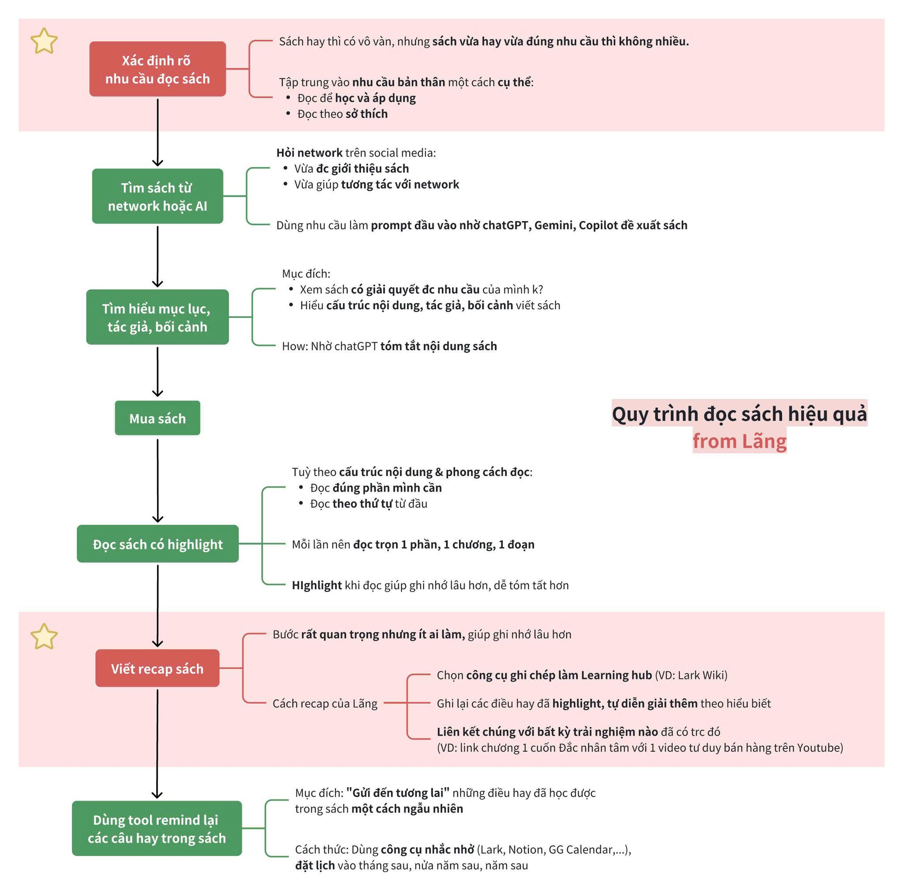

# Bàn về đọc sách

Trong bối cảnh cuộc sống hiện đại và đủ kiểu phương tiện giải trí, việc đọc đôi khi bị xem là một hoạt động nhàm chán đối với một bộ phận không nhỏ công chúng. Đối với những người có ít thời gian hoặc chưa từng phát triển thói quen này, thế giới của những trang viết có thể dường như xa lạ hoặc khó tiếp cận. 

Tuy nhiên, giá trị mà việc đọc mang lại là vô cùng to lớn và bền vững, không chỉ giới hạn trong việc tiếp thu kiến thức mà còn định hình tư duy và làm phong phú đời sống tinh thần của mỗi cá nhân ở mọi lứa tuổi.

Khi đề cập đến việc đọc, nhiều người thường hình dung về những cuốn sách in dày dặn. Thực tế, khái niệm đọc ngày nay đã mở rộng rất nhiều. Nó bao gồm việc tiếp nhận thông tin và kiến thức qua báo chí, tạp chí, các bài viết trực tuyến chất lượng, blog chuyên ngành, tài liệu nghiên cứu, văn học mạng, truyện tranh (dưới góc độ tiếp nhận câu chuyện và hình ảnh kết hợp), thơ ca, và vô số các ấn phẩm điện tử khác. Bản chất cốt lõi của việc đọc là sự tương tác chủ động của trí óc với ngôn ngữ viết, từ đó giải mã thông tin, khám phá ý tưởng và xây dựng nên những kết nối mới trong suy nghĩ.

Dù có thể ai cũng biết lợi ích của việc đọc (không chỉ là đọc sách), mình vẫn xin phép liệt kê một số các giá trị của việc đọc:

**Phát triển tư duy và mở rộng kiến thức:** Việc đọc là nền tảng vững chắc cho sự phát triển tư duy. Khi đọc, bộ não được rèn luyện khả năng phân tích, tổng hợp, đánh giá thông tin và hình thành quan điểm cá nhân. Đọc càng nhiều, chúng ta càng tiếp cận với đa dạng chủ đề, lĩnh vực, từ đó mở rộng vốn kiến thức, hiểu biết sâu sắc hơn về thế giới xung quanh và các vấn đề phức tạp trong cuộc sống.

**Nâng cao năng lực đồng cảm và trí tuệ cảm xúc:** Tiếp xúc với đa dạng câu chuyện, hoàn cảnh, và góc nhìn của các nhân vật hoặc tác giả giúp người đọc bồi đắp khả năng đồng cảm, thấu hiểu tâm lý con người và các mối quan hệ xã hội. Điều này trực tiếp góp phần nâng cao trí tuệ cảm xúc và kỹ năng tương tác giữa người với người.

**Giảm căng thẳng và cảI thiện sức khỏe tinh thần:** Trong nhịp sống hối hả, việc dành thời gian đọc có thể là một phương pháp hiệu quả để giảm căng thẳng, cho phép tâm trí được thư giãn và tạm thời thoát ly khỏi những lo toan thường nhật. Đọc còn giúp cải thiện chất lượng giấc ngủ và rèn luyện sự tập trung.

**Phát triển ngôn ngữ và khả năng diễn đạt:** Thường xuyên đọc giúp chúng ta tiếp xúc với vốn từ vựng phong phú, các cấu trúc câu đa dạng và cách hành văn hiệu quả. Điều này không chỉ làm giàu khả năng ngôn ngữ mà còn cải thiện đáng kể kỹ năng nói và viết của mỗi người.

### Xàm thêm đôi chút về quy trình đọc sách ^^!
Bài viết ở trên đã cung cấp cho bạn một hướng tư duy để bắt đầu việc đọc rồi đó. Dưới đây sẽ là một hướng dẫn ngắn giúp bạn có một quy trình đọc sách cơ bản, được trích từ [bài viết này trên Facebook](https://www.facebook.com/photo/?fbid=3630068103804007&set=gm.1258498735262538&idorvanity=186965029082586).

Quy trình gồm 7 bước, có thể linh hoạt tuỳ hoàn cảnh:

1. Xác định rõ nhu cầu đọc sách (Quan trọng)
2. Tìm sách từ network hoặc AI
3. Tìm hiểu mục lục, tác giả, bối cảnh
4. Mua sách
5. Đọc sách có highlight
6. Viết recap sách (quan trọng)
7. Dùng tool để remind lại các câu hay trong sách.

_Được trích từ bài đăng tương ứng._

### Tóm lại

Đọc không chỉ là một hoạt động tiếp thu thông tin đơn thuần. Nó là một hành trình nuôi dưỡng tâm hồn, mở rộng tri thức, và trang bị cho mỗi người những kỹ năng cần thiết để đối diện và làm phong phú thêm cuộc sống của chính mình. Bất kể tuổi tác hay ngành nghề, việc dành thời gian cho việc đọc là một khoản đầu tư cho bản thân – một khoản đầu tư chắc chắn sẽ sinh lời theo những cách không ngờ tới.

Hãy xem việc đọc như một cánh cửa dẫn vào một thế giới đầy tiềm năng đang chờ bạn khám phá.