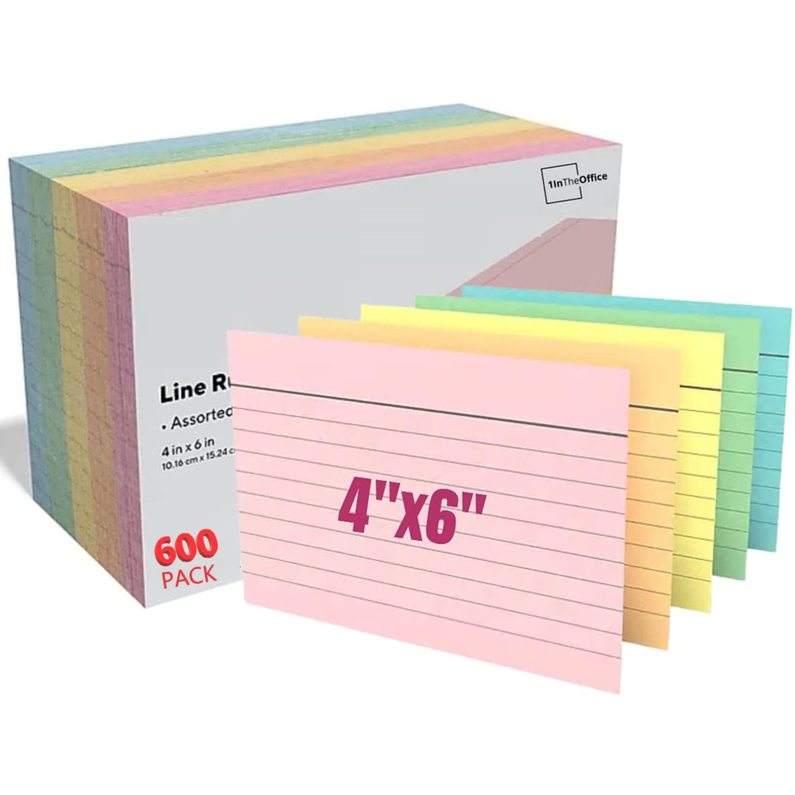

# Thói quen

Đây là một hướng dẫn _rất chi là đơn giản_ để xây dựng một thói quen. Mình viết lại từ "[The X Effect](http://www.reddit.com/r/getdisciplined/comments/1x99m6/im_a_piece_of_shit_no_more_games_no_more_lies_no/cf9dz72)" (Trên Reddit).

### Hôm nay, hãy bắt tay vào làm việc sau đây:

- Mở một bản nhạc nền nhẹ nhàng mà bạn thích. Gợi ý: [Tchaikovsky - Swan Lake Op. 20, Act II No. 10, Scene](https://www.youtube.com/watch?v=xVBNVR1wQT8)
- Chuẩn bị một tập giấy chỉ số 4x6 (4x6 index cards), một bút chì, một bút bi (hoặc bút lông, hay bút gì cũng được). Đây là hình của cái index cards ở trên:

    

- Dùng bút chì kẻ 6 đường dọc và 6 đường ngang trên một tờ giấy để tạo thành một bảng 7x7 — tổng cộng 49 ô vuông.
- **Đừng rút điện thoại ra.** Ngồi vào bàn học, bàn làm việc hay ở quán cà phê hoặc thư viện.
- BÂY GIỜ:  Chọn ra một thói quen hàng ngày bạn muốn khắc sâu vào mình. (Ví dụ: thiền 9 phút mỗi ngày, tập thể dục 7 phút...). Đừng chọn việc quá khó. Tập thể dục 2 phút mỗi ngày thành công đều đặn còn tốt gấp vạn lần việc cố chạy 5km trong một ngày rồi bỏ. Bạn hoàn toàn có thể *nâng cấp* mục tiêu dần dần sau. Nhưng bây giờ, điều bạn cần là tần suất, là sự lặp đi lặp lại — chứ không phải để gây ấn tượng với ai. Nếu hôm nay bạn làm được = bạn dánh dấu **X**. Không làm được = để trống. *Chỉ có LÀM (DO), hoặc KHÔNG LÀM (DON'T).*
- Mặt sau của tấm thẻ: Viết một vài lý do _tại sao_ bạn lại muốn hình thành (hoặc phá bỏ) thói quen này. Nó cần phải *thật* (với bạn), ngắn gọn. Nếu bạn thực sự rèn luyện cho mình thói quen tốt này chẳng hạn, cuộc sống của bạn sẽ thay đổi. Đây là một bước không hề nhỏ trên con đường cải thiện bản thân. Sẽ có lúc bạn cần phải lật mặt sau tấm thẻ ra và nhắc mình lý do vì sao bạn bắt đầu. Nếu cần thì gọi thêm một ly cà phê nếu đang ở quán cafe, và ngồi đó đến khi viết xong lý do thật sự của mình.
- **Bắt đầu ngay: Hôm nay. Làm luôn**. Mỗi ô vuông tương ứng với một ngày. Tấm thẻ gồm 7 tuần, tương ứng với 49 ngày. Ngay khi hoàn thành ngày đầu tiên, lấy bút bi (hoặc bút chì hay gì cũng được) ra và đánh một dấu **X** to vào ô đầu tiên. (Hoặc để đến tối làm cũng được). Cảm giác được đánh dấu **X** thích lắm =)).
- Bạn có thể làm nhiều thẻ cho nhiều thói quen khác nhau cùng lúc, nhưng đừng tham quá — để sau hãy tính. Ghi rõ trên mỗi thẻ là thói quen gì.

### Đến ngày thứ 50:

1. **Bạn đã hình thành thói quen đó.** (Nếu bạn Google, sẽ thấy nhiều nghiên cứu nói rằng cần 66 ngày để tạo thói quen (Chứ không phải 21 như nhiều người đã đọc). Nhưng 50 là con số ổn đấy).
2. **Tự nghĩ ra một *nghi lễ* với tấm thẻ.** Đốt nó. Dán lên tường. Gửi cho ai đó. Đổi lấy phần thưởng mà bạn đã quyết định sẽ dành tặng cho chính mình nếu mình hoàn thành. Tùy bạn.
3. **Nhưng điều tuyệt vời nhất là:** Đó là bằng chứng cụ thể cho sự phát triển của bản thân, càng rèn luyện càng khỏe hơn. Nhìn lại tấm thẻ đi. Bạn đã "tập gym" cho bộ não của bản thân suốt 49 ngày. Đây là **tiến bộ thật sự**.
4. **Và sau đó... bạn làm thẻ mới để duy trì chuỗi.**

Trong những lúc *hiểm nguy*, bạn có thể lật mặt sau của thẻ thói quen nào đó bất kì, nhìn lại lý do lại sao bạn lại bắt đầu xây dựng thói quen này, cũng như hít một hơi thật sâu (*có ích phết, thật đấy*).

### Lỡ mất chuỗi thì sao?

Thì cái danh sách chuỗi của bạn sẽ có một khoảng trống, trông không được đẹp mắt lắm.

Nhưng khi có một ô trắng, hãy làm 2 việc:

1. **Ngày hôm sau PHẢI có dấu X.** Đây là luật số 1. Viết luôn luật này ra mặt sau thẻ:
   "Nếu rơi vào "ô trắng" thì phải thoát ra ngay, không được chần chừ hay "để [lần lữa](https://bunchaway.github.io/tudien/tim-kiem.html?q=l%E1%BA%A7n%20l%E1%BB%AFa)."

2. **Viết xuống lý do.** Thường là những lý do khá là trời ơi đất hỡi — và không khó để khắc phục. Kiểu như: "Tôi không đi ngủ đúng giờ vì chuông báo giờ ngủ quá nhẹ". Viết vào chính cái ô trắng đó cũng được. Đó là toàn bộ "hình phạt". Sau đó quay lại đọc mục số 1.

Các cụ có câu: "*vạn sự khởi đầu nan*". Điều khó nhất trong cả một ngày mùa đông có lẽ chỉ đơn giản là việc ra được khỏi giường. Bạn sẽ bắt đầu nhỏ. Nhưng đó là một sự khởi đầu nghiêm túc. Và rất cụ thể. Bạn sẽ ghi được vài điểm đầu tiên, có thêm một chút tự tin, tự chứng minh với bản thân rằng bạn làm được, rèn luyện "cơ bắp" ý chí của mình, rồi sau đó nâng cấp độ khó sau. Nếu bạn phải bắt đầu bằng mấy quả tạ tay màu hồng 2kg trước mặt mọi người thì cũng kệ. Đừng cố quá sức. Sau khi bạn quen hơn với cái phản xạ phải đối mặt với thất bại, ngã rồi lại tự bật dậy, lúc đó hãy thử thách giới hạn của mình. Nhưng ở vòng này, chỉ cần tạo được chút đà trước và không cần phải quá đờ ra ma (drama) hóa mọi thứ lên. Việc này sẽ thay đổi cách bạn nhìn nhận mọi thứ cũng như thay đổi sức mạnh của chính bạn. Mọi thứ sẽ trở nên thực tế hơn một chút, tươi sáng hơn một chút. Những sự thay đổi tích cực đến một cách tự nhiên. Nó giúp đầu óc bạn thông thoáng để tự phê bình bản thân một cách *có suy nghĩ*, thay vì nghe theo cái bộ não hoang tưởng, nói dối, khốn kiếp kia.

Về cơ bản thì đây chỉ là “chiêu nối chuỗi” (chains) được mình game hóa một chút, nhưng nó thực sự hiệu quả. Bạn dùng lịch cũng được, nhưng mình nghĩ là dùng thẻ thì nó sẽ có cảm giác thử thách kiểu chinh phục “ngọn núi 50 ngày”. Hiện tại sẽ luôn là **HÔM NAY**. Lý do bạn làm việc này (viết ở mặt sau của thẻ) chẳng liên quan gì đến việc hôm đó là thứ mấy. Đây là một chuyến phiêu lưu dài, nhưng là một chuyến phiêu lưu thú vị và đáng để bạn thấy hào hứng. Điều bạn cần là được đắm mình vào cuộc phiêu lưu đó. Hoàn cảnh thì vẫn thế, nhưng cách nhìn của bạn đã thay đổi, đời có thể vẫn sẽ như l, nhưng nó không còn như l như trước nữa. Nó thú vị hơn nhiều khi nhận ra rằng bạn đã nhập cuộc và sẵn sàng chơi tới cùng.