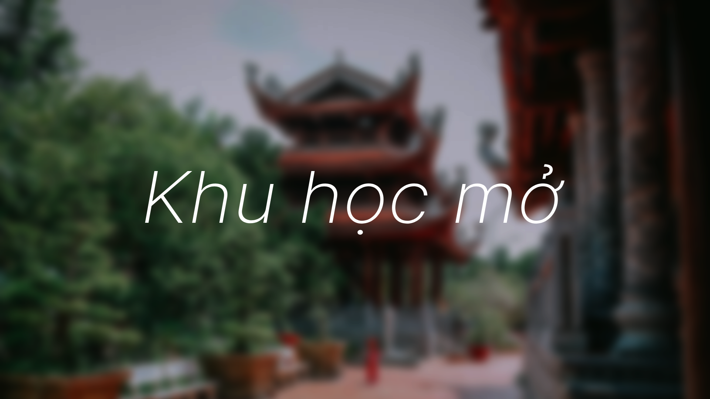

# Khu học mở

**Khu học mở** là một trang hướng dẫn, lộ trình và tổng hợp cách học lẫn tài nguyên cho rất nhiều môn học lẫn lĩnh vực khác nhau. Các tài nguyên được tổng hợp ở trang phần lớn là các tài nguyên được các tác giả và cộng đồng làm chia sẻ hoàn toàn miễn phí trên mạng. Bạn chỉ cần có một thiết bị có thể truy cập mạng là có thể bắt đầu học.

### Hết!
Cảm ơn mọi người khá nhiều,

*duykhanh471* (và khá nhiều [tình nguyện viên khác](cam-on.md) nữa).

